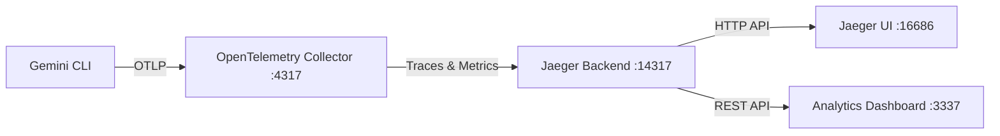

# Gemini CLI Analytics Dashboard

🚀 **Advanced analytics dashboard and monitoring tool for Gemini CLI** with real-time metrics, comprehensive token tracking, and interactive telemetry visualization.

## ✨ Features

### 🎯 **3-Tab Analytics Interface**
- **📊 Analytics Tab** - Interactive charts with date filtering (last 7, 30, 90 days, or custom range)
- **📋 Metrics Logs Tab** - Paginated, filterable metrics logs with detailed breakdowns
- **🔍 Trace Logs Tab** - Distributed tracing logs with span analysis and filtering

### 📈 **Real-time Metrics Monitoring**
- **Session Tracking** - Monitor CLI sessions with duration and status
- **Token Analytics** - Track Input, Output, Thoughts, and Cached tokens
- **Tool Usage** - Monitor tool calls with success rates and performance
- **API Performance** - Real-time API response times and success rates

### 🎨 **Interactive Visualizations**
- **Token Usage Distribution** - Doughnut chart showing token breakdown by type
- **Sessions Over Time** - Bar chart tracking daily session activity
- **API Response Times** - Line chart monitoring performance trends
- **Tool Usage Patterns** - Bar chart analyzing tool execution frequency

### 🛠️ **Advanced Features**
- **Date Range Filtering** - Analyze data for specific time periods
- **Real-time Updates** - Auto-refresh every 30 seconds
- **Data Export** - Download analytics as JSON for further analysis
- **Responsive Design** - Works on desktop, tablet, and mobile
- **Dark/Light Theme** - Toggle between themes for comfort


## 📊 Dashboard Overview

### **Main Analytics Cards**
- **Total Sessions** - Active and historical CLI sessions with weekly trends
- **Total Tools** - Tool execution count with success rates and performance metrics
- **Total Tokens** - Comprehensive token tracking (Input, Output, Thoughts, Cached)
- **Total API Calls** - API usage statistics with average response times and success rates

### **📈 Analytics Tab Features**
- **Interactive Charts** - 4 real-time visualization charts
- **Date Range Filters** - Last 7/30/90 days or custom date selection
- **Token Breakdown** - Detailed analysis of all token types
- **Performance Trends** - API response time analysis and session patterns

### **📋 Metrics Logs Tab**
- **Paginated Display** - 20 items per page with navigation
- **Advanced Filtering** - Filter by All, Token, Session, or Tool metrics
- **Detailed Information** - Complete metric attributes and timestamps
- **Color-coded Badges** - Visual categorization of metric types

### **🔍 Trace Logs Tab**
- **Distributed Tracing** - Jaeger trace visualization
- **Span Analysis** - Individual operation timing and performance
- **Filtering Options** - Filter by All, API, Tool, or Error traces
- **Performance Insights** - Duration analysis and bottleneck identification

## 🚀 Quick Start

### Prerequisites
- [Gemini CLI](https://github.com/google-gemini/gemini-cli) installed
- Node.js 18+ 
- Docker (for Jaeger telemetry backend)

### 1. Install Gemini CLI
```bash
npm install -g @google/gemini-cli
```

### 2. Run Gemini with Telemetry
```bash
gemini --telemetry -- --target=local
```

### 3. Launch the Analytics Dashboard
```bash
# Option A: Using npx (recommended)
npx gemini-cli-templates@latest --analytics

# Option B: Clone and run locally
git clone https://github.com/davila7/gemini-cli-templates.git
npm install
npm start
```

### 4. Generate Telemetry Data
```bash
# Enable telemetry in your Gemini CLI commands
gemini --telemetry "Analyze this codebase"
gemini --telemetry "What files need refactoring?"
gemini --telemetry "Generate unit tests for this function"
```

### 5. View Analytics
Open [http://localhost:3337](http://localhost:3337) to access the dashboard.

## 🏗️ Architecture

The dashboard integrates with the official Gemini CLI telemetry stack:



- **Gemini CLI** sends telemetry via OpenTelemetry Protocol (OTLP)
- **OpenTelemetry Collector** processes and routes telemetry data
- **Jaeger** stores traces and provides query APIs
- **Analytics Dashboard** connects to Jaeger's REST API for data visualization

## 🛠️ Development

### Local Development
```bash
git clone https://github.com/davila7/gemini-cli-templates.git
npm install
npm run dev  # Start with auto-reload
```

### API Endpoints
- `GET /api/metrics` - Retrieve metrics from OpenTelemetry logs
- `GET /api/traces` - Fetch distributed traces from Jaeger
- `GET /api/services` - List available services in Jaeger

### Environment Variables
```bash
JAEGER_URL=http://localhost:16686  # Jaeger UI endpoint
OTEL_LOGS_PATH=~/.gemini/tmp       # OpenTelemetry logs location
PORT=3337                          # Dashboard port
```

## Data Sources

### Metrics
- Session tracking and duration
- Tool execution counts and success rates
- Token consumption (input/output)
- Model usage statistics

### Traces  
- API call performance and timing
- Tool execution flows
- Error tracking and debugging
- Request/response correlation

## Contributing

This is part of the [Gemini CLI Templates](https://github.com/davila7/gemini-cli-templates) project. Contributions are welcome!

1. Fork the repository
2. Create a feature branch (`git checkout -b feature/amazing-feature`)
3. Commit your changes (`git commit -m 'Add amazing feature'`)
4. Push to the branch (`git push origin feature/amazing-feature`)
5. Open a Pull Request

## License

MIT License - see the [LICENSE](LICENSE) file for details.

## 🔗 Related Projects

- [Gemini CLI](https://github.com/google-gemini/gemini-cli) - Official Google Gemini CLI
- [OpenTelemetry](https://opentelemetry.io/) - Observability framework
- [Jaeger](https://www.jaegertracing.io/) - Distributed tracing platform

---

**⭐ Star this repo if you find it useful!** | **🐛 Report issues** | **💡 Request features**