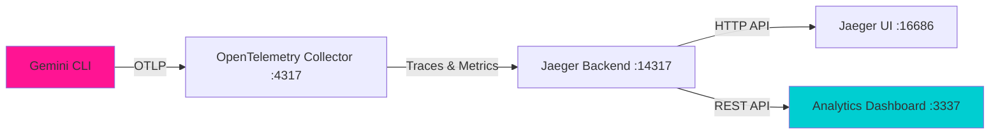

# Gemini CLI Templates

CLI tool for configuring and monitoring Gemini CLI


## Features

- **Real-time Metrics Monitoring** - Track sessions, tool usage, tokens, and API calls
- **Distributed Tracing** - Visualize execution flows and performance bottlenecks  
- **Data Export** - Download analytics data as JSON for further analysis


## 🎯 Dashboard Metrics

### Main Analytics Cards
- **Total Sessions** - Unique Gemini CLI sessions with weekly breakdown
- **Total Tools** - Number of tools executed with success rates
- **Total Tokens** - Input/output token consumption tracking
- **Total API Calls** - Gemini API usage with average response times

### Detailed Views
- **Overview Tab** - Comprehensive metrics breakdown with session details
- **Traces Tab** - Distributed tracing visualization with span timings
- **Current Session** - Real-time progress tracking for active sessions

## 🚀 Quick Start

### Prerequisites
- [Gemini CLI](https://github.com/google-gemini/gemini-cli) installed
- Node.js 18+ 
- Docker (for Jaeger telemetry backend)

### 1. Start Gemini CLI Telemetry
```bash
cd /path/to/gemini-cli
npm run telemetry -- --target=local
```

### 2. Launch the Analytics Dashboard
```bash
# Option A: Using npx (recommended)
npx gemini-cli-templates@latest --analytics

# Option B: Clone and run locally
git clone https://github.com/davila7/gemini-cli-templates.git
npm install
npm start
```

### 3. Generate Telemetry Data
```bash
# Enable telemetry in your Gemini CLI commands
gemini --telemetry "Analyze this codebase"
gemini --telemetry "What files need refactoring?"
gemini --telemetry "Generate unit tests for this function"
```

### 4. View Analytics
Open [http://localhost:3337](http://localhost:3337) to access the dashboard.

## 🏗️ Architecture

The dashboard integrates with the official Gemini CLI telemetry stack:



- **Gemini CLI** sends telemetry via OpenTelemetry Protocol (OTLP)
- **OpenTelemetry Collector** processes and routes telemetry data
- **Jaeger** stores traces and provides query APIs
- **Analytics Dashboard** connects to Jaeger's REST API for data visualization

## 🛠️ Development

### Local Development
```bash
git clone https://github.com/davila7/gemini-cli-templates.git
npm install
npm run dev  # Start with auto-reload
```

### API Endpoints
- `GET /api/metrics` - Retrieve metrics from OpenTelemetry logs
- `GET /api/traces` - Fetch distributed traces from Jaeger
- `GET /api/services` - List available services in Jaeger

### Environment Variables
```bash
JAEGER_URL=http://localhost:16686  # Jaeger UI endpoint
OTEL_LOGS_PATH=~/.gemini/tmp       # OpenTelemetry logs location
PORT=3337                          # Dashboard port
```

## 🎨 Customization

The dashboard uses CSS custom properties for easy theming:

```css
:root {
  --gemini-pink: #FF1493;
  --gemini-purple: #8A2BE2;
  --gemini-blue: #1E90FF;
  --gemini-cyan: #00CED1;
  /* Customize colors while maintaining Gemini identity */
}
```

## 📊 Data Sources

### Metrics
- Session tracking and duration
- Tool execution counts and success rates
- Token consumption (input/output)
- Model usage statistics

### Traces  
- API call performance and timing
- Tool execution flows
- Error tracking and debugging
- Request/response correlation

## 🤝 Contributing

This is part of the [Gemini CLI Templates](https://github.com/davila7/gemini-cli-templates) project. Contributions are welcome!

1. Fork the repository
2. Create a feature branch (`git checkout -b feature/amazing-feature`)
3. Commit your changes (`git commit -m 'Add amazing feature'`)
4. Push to the branch (`git push origin feature/amazing-feature`)
5. Open a Pull Request

## 📄 License

MIT License - see the [LICENSE](LICENSE) file for details.

## 🔗 Related Projects

- [Gemini CLI](https://github.com/google-gemini/gemini-cli) - Official Google Gemini CLI
- [Gemini CLI Templates](https://github.com/davila7/gemini-cli-templates) - Community templates and tools
- [OpenTelemetry](https://opentelemetry.io/) - Observability framework
- [Jaeger](https://www.jaegertracing.io/) - Distributed tracing platform

---

**⭐ Star this repo if you find it useful!** | **🐛 Report issues** | **💡 Request features**